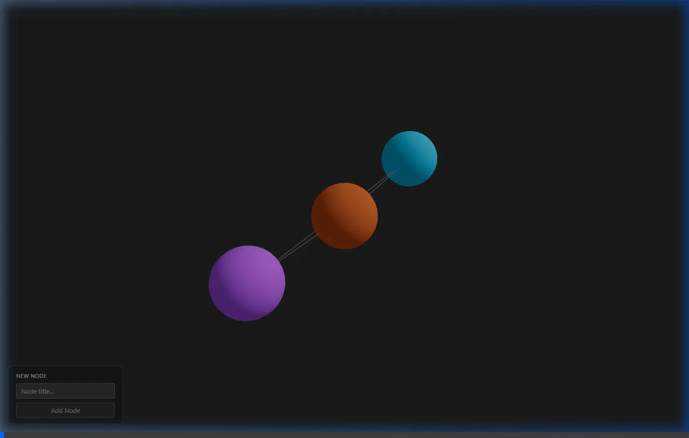

# Ariadna 🧵

Ariadna is a browser-first prototype of a **3D / hierarchical thought-mapping interface**. 

It is designed to be a calm, clean, and spatial tool for graph-first thinking. It is not a game or a flashy visual demo, but a structured interface where text, structure, and 3D space connect to support understanding.



## 📌 Current Features (MVP)
- **3D Spatial Graph**: Nodes rendered in 3D space using WebGL.
- **Node Interaction**: Click to select nodes (with raycasting feedback) and view details in a clear 2D DOM overlay.
- **Node Creation**: Dynamic panel to create new nodes (assigns random colors from a palette and positions them automatically).
- **Static Edges**: Clear visual 3D connections between nodes.
- **Navigation**: Full spatial navigation (`OrbitControls` with Orbit, Pan, and Zoom) for smooth scene exploration.

## 🛠 Tech Stack
- **React** + **TypeScript**
- **Vite** (Build Tool)
- **Three.js** + **@react-three/fiber** + **@react-three/drei** (3D Rendering Engine)
- **Vanilla CSS** (Clean, minimal visual language)

## 🚀 How to Run Locally

1. **Install dependencies**:
   ```bash
   npm install
   ```
2. **Start the development server**:
   ```bash
   npm run dev
   ```
3. **Open the app**:
   Navigate to `http://localhost:5173` in your browser.

## 🗺 Architecture Philosophy
- **Prototype first**: Focus on minimal, testable feature slices.
- **Clear Separation**: `Scene.tsx` handles pure 3D rendering (stateless component). `App.tsx` manages the global React state. DOM UI (`NodeCard`, `NodeCreator`) acts as an overlay over the WebGL canvas.
- **Zero bloat**: No heavy abstractions, no unnecessary dependencies. Keep files modular and readable.

---
*Ariadna — your thread through the labyrinth of thoughts.*
